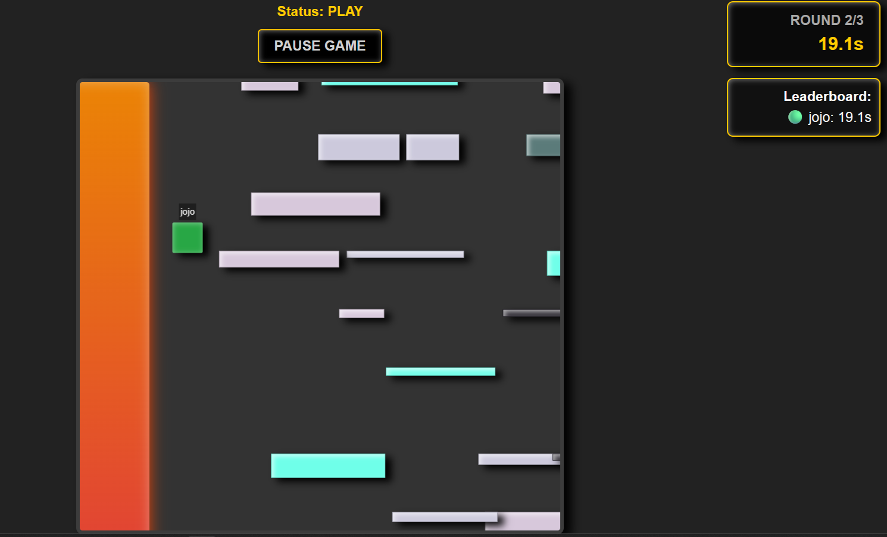
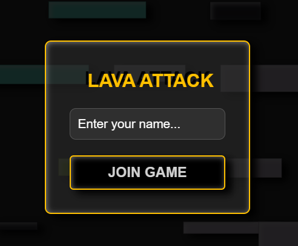
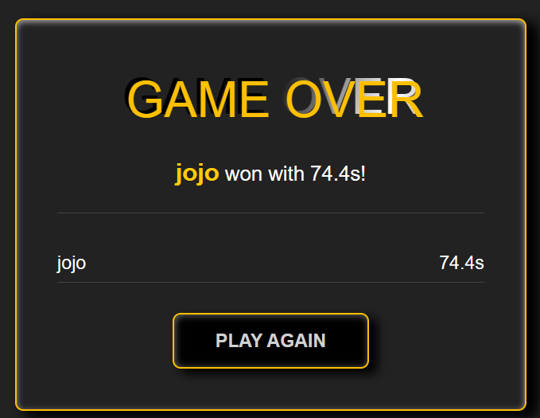

<div align="center">
  <br />
  <h1 style="font-size: 3.5rem; font-weight: bold;">🌋 LAAAVAAA ATTAAAAACK</h1>
  <p>
    <strong>Survival Platformer. 4 Players. No Canvas.</strong>
  </p>
  <p>
    Динамічний мультиплеєрний екшн у реальному часі, де головний ворог — не тільки інші гравці, а й сама фізика світу.
  </p>

  <p>
    <a href="#-ключові-можливості">Функціонал</a> •
    <a href="#-ігрова-механіка">Механіка</a> •
    <a href="#-технічний-стек">Стек технологій</a> •
    <a href="#-швидкий-запуск-local">Запуск</a> •
    <a href="https://laaav-ataaack-game.vercel.app/">Грати Online</a>
  </p>

  <!-- Badges -->
  
  
  
  
  
</div>

<br />

## 📖 Про проект

**Lava Attack** — технічний експеримент із розробки високопродуктивних ігор без використання HTML5 Canvas. Гра побудована виключно на
**DOM-елементах**, де плавність анімації досягається через апаратне прискорення GPU.

Проект реалізує концепцію **Authoritative Server**: усі фізичні розрахунки, перевірка колізій та стан лави обробляються на сервері, що гарантує чесну
гру та синхронізацію для всіх 4-х учасників.

## ✨ Ключові можливості

### 🕹️ Геймплей у реальному часі

- **Мультиплеєр:** Одночасна гра для 2-4 гравців.
- **Unique Identity:** Система унікальних імен гравців.
- **Взаємодія:** Механіка поштовхів (Shove) для виштовхування опонентів у лаву.
- **Jetpack:** Обмежена можливість польоту для екстремального порятунку.

### 🌍 Динамічний світ

- **Мінлива гравітація:** Напрямок падіння змінюється випадковим чином, повністю перевертаючи геймплей.
- **Rising Lava:** Лава, що поглинає простір у напрямку, протилежному до поточної гравітації.
- **Procedural Map:** Рандомна генерація платформ, що забезпечує унікальність кожного раунду.

### 🛠 Технічні особливості

- **DOM-only Rendering:** Жодного пікселя на Canvas. Тільки чистий HTML/CSS.
- **60 FPS:** Використання `requestAnimationFrame` та `will-change: transform`.
- **Global Pause:** Можливість лідера зупинити гру для всіх учасників одночасно.

## 🧠 Ігрова механіка

1.  **Фізичний рушій:** Власна реалізація AABB колізій із snapping до рухомих платформ.
2.  **Синхронізація:** Сервер відправляє стан світу 30-60 разів на секунду, а клієнт використовує інтерполяцію для ідеально плавного руху.
3.  **Система раундів:** Гра триває 3 раунди. Перемагає той, хто сумарно протримався найдовше.

## 🛠 Технічний стек

### **Backend (Node.js)**

- **TypeScript** Типізація всієї ігрової логіки
- **Socket.io** Низька затримка через WebSockets
- **Express** Сервер статичних ресурсів
- **Fly.io** Хостинг для ігрового сервера

### **Frontend (Vanilla TS)**

- **Vite** Збірка та швидка розробка
- **Socket.io-client**
- **CSS3 Animations & Filters** Ефекти магми та світіння

## 📸 Скріншоти

<div align="center"> 
  
  <p><em>Напружений момент: Гравітація змінилася, лава наступає зліва!</em></p>
</div>

<div align="center"> 
  
  <p><em>Вхід</em></p>
   
  <p><em>Завершення гри</em></p>
</div>

## 🚀 Швидкий запуск (Local)

### 📋 Вимоги

- Node.js 20+
- npm / yarn

### Перш за все, клонуй репозиторій

```bash
    git clone https://gitea.kood.tech/mykolalytvynenko/multi-player
```

### 🏃‍♂️ Крок 1: Запуск сервера

Відкрий перший термінал:

```bash
cd server
npm install
npm run dev
```

### 💻 Крок 2: Запуск клієнта

Відкрий другий термінал:

```bash
cd client
npm install
npm run dev
```

Гра буде доступна за адресою `http://localhost:5173`. **Важливо:** Сервер повинен бути запущений першим!

## 🌐 Віддалений доступ

Гра розгорнута на безкоштовному хостингу.

- **Frontend:** Vercel
- **Backend:** Fly.io
- **Обмеження:** Через безкоштовний тариф сервера частота оновлень обмежена до **30 FPS**.

👉 [**ГРАТИ ЗАРАЗ**](https://laaav-ataaack-game.vercel.app/)

---

<div align="center">
  <p>Розроблено з ❤️ для запеклих раундів з друзями</p>
</div>
